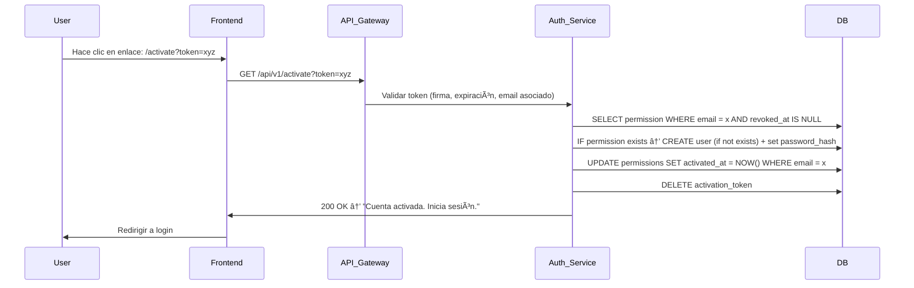
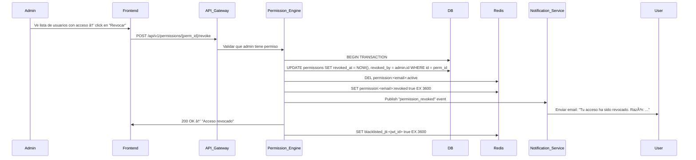

### USER
nuevo desafio dentro del espectro emergqr  como se puede hacer para que un usuario pida acceso a una pagiana o al nuestro sistema mejor dicho y de forma remota le podamos conceder ese permiso y antes de concederlo poder marcar el tiempo de duracion  permanete o por lapsos de tiempo pero que eso permisoso tambien puedan ser revocables quiero que lo pienses bien prepara un esquema la arquitectura   y si puedes los diagramas

Vamos a diseñar un sistema de control de acceso remoto con permisos temporales y revocables.

Requisitos:

    Un usuario puede solicitar acceso al sistema.

    Un administrador puede conceder el acceso, definiendo:

        Si el acceso es permanente o por un lapso de tiempo.

        En caso de ser por tiempo, especificar la duración.

    Los permisos concedidos deben ser revocables en cualquier momento.

Arquitectura propuesta:

Vamos a construir una aplicación web con una arquitectura cliente-servidor. Utilizaremos:

    Frontend: Interfaz de usuario para que los usuarios soliciten acceso y para que los administradores gestionen los permisos.

    Backend: API RESTful que maneje las solicitudes y permisos.

    Base de datos: Almacenar usuarios, solicitudes de acceso y permisos.

Componentes:

    Módulo de autenticación: Gestiona el login de usuarios y administradores.

    Módulo de solicitudes: Los usuarios no autenticados pueden solicitar acceso (registrando sus datos básicos).

    Módulo de administración: Los administradores pueden ver las solicitudes, aprobarlas (definiendo la duración) o revocar permisos.

    Módulo de permisos: Middleware que verifica si un usuario tiene acceso y si aún está vigente.

Flujo:

    Un usuario visita la página y no tiene acceso. Se le presenta un formulario para solicitar acceso (ingresando email, nombre, razón, etc.).

    El sistema registra la solicitud en la base de datos con estado "pendiente".

    El administrador recibe una notificación (por ejemplo, por email) o ingresa al sistema y ve la solicitud pendiente.

    El administrador aprueba la solicitud, definiendo:

        Tipo de acceso: permanente o temporal.

        Si es temporal, define la fecha de expiración.

    El sistema actualiza el estado de la solicitud a "aprobado" y crea un registro de permiso con la fecha de expiración (si es permanente, la fecha de expiración será nula).

    El sistema envía un email al usuario notificándole que su acceso ha sido aprobado y las instrucciones para acceder.

    El usuario puede acceder al sistema hasta que su permiso expire o sea revocado.

    El administrador puede revocar el acceso en cualquier momento, lo que actualiza el estado del permiso a "revocado" y niega el acceso.

Base de datos:

Tablas:

    users: id, email, name, password (hash), created_at, updated_at.

    access_requests: id, user_id, reason, status (pendiente, aprobado, rechazado), requested_at, reviewed_by, reviewed_at.

    permissions: id, user_id, granted_by (admin user id), granted_at, expires_at (nullable), revoked_at, revoked_by.

Nota: En este diseño, un usuario debe estar registrado en la tabla users para tener credenciales de login. Cuando se aprueba una solicitud, se crea un usuario (si no existe) y se le asigna un permiso.

Alternativa: Podríamos tener una tabla users que incluya tanto a los administradores como a los usuarios regulares. Los usuarios regulares tendrían un campo que indique que su cuenta está activa y con permiso de acceso.

Para el login, usaremos JWT (JSON Web Tokens) que incluyan el user_id y información de permisos. En cada solicitud, el backend verificará el token y consultará la base de datos para asegurar que el usuario tiene un permiso activo (no expirado y no revocado).

Diagrama de secuencia para la concesión de acceso:

    Usuario -> Frontend: Solicita acceso (llena formulario)

    Frontend -> Backend: Envía datos de solicitud

    Backend -> DB: Guarda solicitud de acceso (estado: pendiente)

    Backend -> Admin: Notifica nueva solicitud (email, o en el panel)

    Admin -> Frontend: Inicia sesión y ve solicitudes pendientes

    Admin -> Frontend: Aprueba solicitud (define duración)

    Frontend -> Backend: Envía aprobación

    Backend -> DB:

        Actualiza solicitud a aprobado

        Crea registro en permissions con expires_at (si es temporal) o null (permanente)

        Si el usuario no existe, crea un usuario con una contraseña temporal (o envía un enlace para establecer contraseña)

    Backend -> Usuario: Envía email con credenciales o enlace para activar cuenta

    Usuario: Sigue el enlace, establece contraseña y puede acceder.

Diagrama de secuencia para el acceso:

    Usuario -> Frontend: Ingresa credenciales

    Frontend -> Backend: Envía credenciales

    Backend: Verifica credenciales y genera JWT que incluye user_id y rol.

    Backend -> Frontend: Devuelve JWT

    Frontend: Almacena JWT y lo incluye en las siguientes solicitudes.

    Para cada solicitud a un recurso protegido:

        Frontend -> Backend: Solicitud con JWT

        Backend: Verifica JWT y luego verifica en la base de datos que el usuario tenga un permiso activo (no revocado y no expirado).

        Backend -> Frontend: Devuelve los datos solicitados o error de permiso.

Esquema de base de datos detallado:

    users:

        id: int (PK)

        email: varchar(unique)

        name: varchar

        password: varchar (hash)

        created_at: timestamp

        updated_at: timestamp

    access_requests:

        id: int (PK)

        user_id: int (FK a users, puede ser null inicialmente, pero luego se asociará)

        reason: text

        status: enum('pending', 'approved', 'rejected')

        requested_at: timestamp

        reviewed_by: int (FK a users, el admin que revisó)

        reviewed_at: timestamp

    permissions:

        id: int (PK)

        user_id: int (FK a users, unique? No, porque pueden haber múltiples permisos revocados y uno activo, pero nosotros manejaremos uno activo por usuario)

        granted_by: int (FK a users, el admin que concedió el permiso)

        granted_at: timestamp

        expires_at: timestamp (nullable)

        revoked_at: timestamp (nullable)

        revoked_by: int (FK a users, el admin que revocó, nullable)

Nota: Podríamos tener una política de que un usuario solo tiene un permiso activo a la vez. Al conceder un nuevo permiso, se revocarían los anteriores.

Alternativa: Podríamos tener una tabla de permisos con un estado (activo, revocado) y cada vez que se concede un permiso, se crea un nuevo registro y se desactivan los anteriores.

Para simplificar, asumamos que un usuario tiene un solo permiso. Cuando se concede un nuevo permiso, se actualiza el existente o se crea uno nuevo y se revoca el anterior.

Implementación del middleware de permisos:

En el backend, después de autenticar al usuario mediante JWT, se consulta la tabla permissions para el user_id, buscando un registro donde:

    revoked_at IS NULL

    AND (expires_at IS NULL OR expires_at > NOW())

Si existe, se permite el acceso. Si no, se deniega.

Consideraciones de seguridad:

    Las contraseñas deben almacenarse con hash (usando bcrypt o similar).

    Uso de HTTPS para todas las comunicaciones.

    Validación y sanitización de datos de entrada.

Este es un esquema general. Ahora, si necesitas, puedo generar diagramas UML (aunque aquí solo puedo describirlos). Si necesitas diagramas, podrías usar herramientas como draw.io o Lucidchart para crearlos basados en la descripción.

¿Te gustaría que profundizara en algún aspecto en particular?

### ASSISTANT
¡Excelente! Vamos a profundizar en tu desafío con una **arquitectura completa, robusta y escalable** para permitir que usuarios soliciten acceso remoto, con permisos temporales y revocables, todo bajo un control administrativo seguro.

---

## ✅ **Objetivo Final**
Permitir que **cualquier usuario externo** (no necesariamente registrado) solicite acceso al sistema, y que un **administrador apruebe o rechace dicha solicitud remotamente**, definiendo:

- Tipo de acceso: **Permanente** o **Temporal** (con duración específica).
- El acceso puede ser **revocado en cualquier momento**.
- Todo debe ser **auditable, seguro y sin necesidad de que el usuario tenga cuenta previa**.

---

# ğŸ—ï¸ ARQUITECTURA COMPLETA: "Access Request Gateway" (ARG)

## 🧩 Componentes Principales

| Componente | Función |
|----------|---------|
| **Frontend (Web App)** | Interfaz para usuarios (solicitud) y administradores (gestión). |
| **API Gateway** | Entrada única para todas las peticiones. Enrutamiento, autenticación de tokens, rate limiting. |
| **Auth Service** | Gestiona autenticación, generación de JWT y verificación de credenciales. |
| **Access Request Service** | Maneja solicitudes de acceso, estados, notificaciones. |
| **Permission Engine** | Motor central que evalúa si un usuario tiene acceso vigente en tiempo real. |
| **Notification Service** | Envía emails/SMS/webhooks cuando hay cambios (solicitud, aprobación, revocación). |
| **Database (PostgreSQL)** | Almacena todos los datos con integridad transaccional. |
| **Redis** | Caché de permisos activos para alta performance. |
| **Message Queue (RabbitMQ/Kafka)** | Desacopla notificaciones y tareas asíncronas (ej: enviar email). |

---

## 🔠FLUJO COMPLETO DEL SISTEMA

### 1. **Solicitud de Acceso por Usuario (Externo)**
> *Un usuario no registrado visita tu sistema y ve: “¿Necesitas acceso? Solicítalo aquí.â€*

```mermaid
sequenceDiagram
    participant User
    participant Frontend
    participant API_Gateway
    participant Access_Request_Service
    participant DB

    User->>Frontend: Llena formulario (nombre, email, razón, tipo de acceso deseado)
    Frontend->>API_Gateway: POST /api/v1/access-request
    API_Gateway->>Access_Request_Service: Validar entrada (email válido, no spam)
    Access_Request_Service->>DB: INSERT access_request (
        id, email, name, reason, requested_at, status='pending',
        desired_duration_type='temporary/permanent', desired_duration_hours=24
    )
    Access_Request_Service->>Notification_Service: Publish "new_access_request" event
    Notification_Service->>Admin: Enviar email + notificación en panel (webhook o push)
    Access_Request_Service->>Frontend: 201 Created → "Solicitud enviada. Te avisaremos."
```

> 💡 **Importante**: No se crea usuario aún. Solo se registra la solicitud con email como identificador único.

---

### 2. **Aprobación por Administrador (Remota)**
> *El admin recibe notificación, ingresa al panel, revisa y aprueba.*

```mermaid
sequenceDiagram
    participant Admin
    participant Frontend
    participant API_Gateway
    participant Access_Request_Service
    participant Permission_Engine
    participant DB
    participant Redis

    Admin->>Frontend: Inicia sesión (JWT de admin)
    Frontend->>API_Gateway: GET /api/v1/access-requests?status=pending
    API_Gateway->>Access_Request_Service: Autenticar admin → validar rol
    Access_Request_Service->>DB: SELECT solicitantes pendientes
    Access_Request_Service->>Frontend: Devuelve lista con detalles
    Admin->>Frontend: Selecciona solicitud → elige: "Permanente" o "Duración: 7 días"
    Frontend->>API_Gateway: PUT /api/v1/access-requests/{id}/approve
    API_Gateway->>Access_Request_Service: Validar permiso de admin
    Access_Request_Service->>DB: BEGIN TRANSACTION
    Access_Request_Service->>DB: UPDATE access_request SET status='approved', approved_by=?, approved_at=NOW()
    Access_Request_Service->>Permission_Engine: CREATE_PERMISSION(
        user_email = email,
        granted_by_admin_id = admin.id,
        expires_at = NOW() + duration,
        revoked_at = NULL,
        source_request_id = request.id
    )
    Permission_Engine->>DB: INSERT INTO permissions (...) 
    Permission_Engine->>Redis: SET permission:<email>:active <expires_at> EX 3600
    Access_Request_Service->>Notification_Service: Publish "permission_granted" event
    Notification_Service->>User: Enviar email: "¡Tu acceso ha sido aprobado! Usa este enlace para activar tu cuenta y acceder."
    Access_Request_Service->>Frontend: 200 OK → "Permiso concedido"
```

> ✅ **Aquí es clave**:  
> - Se crea un **usuario virtual** en la tabla `users` con `email`, pero **sin contraseña inicial**.  
> - Se genera un **token de activación de cuenta** (JWT de corta vida, 1h), incluido en el email.  
> - El usuario **no puede loguearse hasta activar su cuenta**.

---

### 3. **Activación de Cuenta por Usuario**
> *El usuario hace clic en el enlace del email.*



> 🔒 Ahora el usuario tiene credenciales válidas (email + contraseña) y puede iniciar sesión.

---

### 4. **Inicio de Sesión y Acceso al Sistema**
> *El usuario inicia sesión y el sistema verifica permiso en tiempo real.*

```mermaid
sequenceDiagram
    participant User
    participant Frontend
    participant API_Gateway
    participant Auth_Service
    participant Permission_Engine
    participant Redis
    participant DB

    User->>Frontend: Ingresa email y contraseña
    Frontend->>API_Gateway: POST /api/v1/login
    API_Gateway->>Auth_Service: Verificar credenciales (email + hash)
    Auth_Service->>DB: SELECT user, permission FROM users JOIN permissions ON ...
    Auth_Service->>Permission_Engine: ¿Permiso activo? (revoked_at IS NULL AND (expires_at IS NULL OR expires_at > NOW()))
    Permission_Engine->>Redis: GET permission:<email>:active
    alt Permisos en caché y válidos
        Permission_Engine->>Auth_Service: Permitir acceso
        Auth_Service->>Frontend: Generar JWT de sesión larga (8h-24h) con claims:
            sub: user_id
            email: user@email.com
            role: "external_user"
            expires_at: permission.expires_at
            is_revoked: false
    else Permiso expirado o revocado
        Auth_Service->>Frontend: 403 Forbidden → "Acceso denegado. Contacta al administrador."
    end
```

> ✅ **JWT contiene información crítica**:  
> - `expires_at`: copia del permiso original (para evitar consultas constantes a DB).  
> - `is_revoked`: flag que se actualiza en Redis si se revoca (ver abajo).

---

### 5. **Revocación de Acceso (Administrador)**
> *El admin decide revocar acceso en cualquier momento.*



> 🔥 **Clave de seguridad**:  
> - Se marca el permiso como revocado en DB.  
> - Se elimina el cache en Redis → futuras validaciones fallan.  
> - Se agrega el `jti` (JWT ID) a una lista negra temporal → **las sesiones activas expiren al siguiente refresh o al cerrar sesión**.

---

## ğŸ—ƒï¸ ESQUEMA DE BASE DE DATOS (PostgreSQL)

```sql
-- Usuarios registrados (incluye usuarios externos activados)
CREATE TABLE users (
    id SERIAL PRIMARY KEY,
    email VARCHAR(255) UNIQUE NOT NULL,
    name VARCHAR(255),
    password_hash TEXT,
    created_at TIMESTAMPTZ DEFAULT NOW(),
    updated_at TIMESTAMPTZ DEFAULT NOW(),
    is_active BOOLEAN DEFAULT FALSE
);

-- Solicitudes de acceso (antes de crear usuario)
CREATE TABLE access_requests (
    id SERIAL PRIMARY KEY,
    email VARCHAR(255) NOT NULL,          -- Identificador único antes de crear usuario
    name VARCHAR(255),
    reason TEXT,
    desired_duration_type VARCHAR(20) CHECK (desired_duration_type IN ('permanent', 'temporary')),
    desired_duration_hours INTEGER,       -- Si es temporal
    status VARCHAR(20) CHECK (status IN ('pending', 'approved', 'rejected')) DEFAULT 'pending',
    requested_at TIMESTAMPTZ DEFAULT NOW(),
    approved_at TIMESTAMPTZ,
    approved_by INT REFERENCES users(id),
    rejected_at TIMESTAMPTZ,
    rejected_by INT REFERENCES users(id),
    UNIQUE(email, status)  -- Evita múltiples solicitudes pendientes
);

-- Permisos otorgados (el núcleo del sistema)
CREATE TABLE permissions (
    id SERIAL PRIMARY KEY,
    user_id INT REFERENCES users(id) ON DELETE CASCADE,
    granted_by_admin_id INT REFERENCES users(id) NOT NULL,
    granted_at TIMESTAMPTZ DEFAULT NOW(),
    expires_at TIMESTAMPTZ,               -- NULL = permanente
    revoked_at TIMESTAMPTZ,               -- Si no es NULL, está revocado
    revoked_by_admin_id INT REFERENCES users(id),
    source_request_id INT REFERENCES access_requests(id),
    activated_at TIMESTAMPTZ,             -- Cuándo el usuario activó la cuenta
    metadata JSONB,                       -- Para logs, IP, dispositivo, etc.
    CONSTRAINT chk_active_only_one CHECK (
        (revoked_at IS NULL AND expires_at IS NULL) OR
        (revoked_at IS NULL AND expires_at > NOW()) OR
        (revoked_at IS NOT NULL)
    )
);

-- Tokens de activación de cuenta (corta vida)
CREATE TABLE activation_tokens (
    id SERIAL PRIMARY KEY,
    user_id INT REFERENCES users(id),
    token_hash TEXT NOT NULL,             -- Hash del token
    expires_at TIMESTAMPTZ NOT NULL,
    used_at TIMESTAMPTZ,
    created_at TIMESTAMPTZ DEFAULT NOW()
);

-- Registro de eventos (auditoría)
CREATE TABLE access_events (
    id SERIAL PRIMARY KEY,
    user_id INT REFERENCES users(id),
    action VARCHAR(50),                   -- 'login', 'logout', 'access_granted', 'access_revoked'
    ip_address INET,
    user_agent TEXT,
    occurred_at TIMESTAMPTZ DEFAULT NOW()
);
```

---

## âš™ï¸ COMPONENTES CLAVE DEL SISTEMA

### 🔹 **Permission Engine (Core)**
Función de validación en tiempo real:

```python
def is_access_allowed(email: str) -> bool:
    # 1. Consultar Redis: ¿está revocado?
    if redis.get(f"permission:{email}:revoked"):
        return False

    # 2. Consultar Redis: ¿está activo y expira en X?
    cached_expiry = redis.get(f"permission:{email}:active")
    if cached_expiry:
        expiry = datetime.fromisoformat(cached_expiry)
        if expiry > datetime.now():
            return True
        else:
            redis.delete(f"permission:{email}:active")  # Limpiar cache obsoleto

    # 3. Consultar DB (fallback)
    perm = db.query("""
        SELECT expires_at, revoked_at 
        FROM permissions 
        WHERE user_id = (SELECT id FROM users WHERE email = %s)
        AND revoked_at IS NULL
        AND (expires_at IS NULL OR expires_at > NOW())
        LIMIT 1
    """, (email,))

    if perm and perm.expires_at is None:  # Permanente
        redis.setex(f"permission:{email}:active", 3600, perm.expires_at.isoformat())
        return True
    elif perm and perm.expires_at > datetime.now():  # Temporal
        redis.setex(f"permission:{email}:active", 3600, perm.expires_at.isoformat())
        return True
    else:
        return False
```

> ✅ **Ventaja**: 95% de las validaciones van a Redis → **latencia < 1ms**.

### 🔹 **JWT Claims Personalizados**
Cuando se genera el JWT tras login:

```json
{
  "sub": "user_123",
  "email": "juan@example.com",
  "role": "external_user",
  "expires_at": "2025-04-10T12:00:00Z",   // Copia del permiso
  "is_revoked": false,
  "jti": "uuid-abc123"
}
```

> El backend valida el `jti` contra una lista negra de tokens revocados (en Redis) cada vez que se usa el JWT.

---

## 📊 DIAGRAMA DE ARQUITECTURA GENERAL (Arquitectura de Microservicios)


> **Notas**:
> - Todos los servicios son stateless y escalables.
> - La base de datos es el sistema de verdad; Redis es cache optimizado.
> - RabbitMQ asegura que las notificaciones no se pierdan.

---

## ✅ CARACTERÃSTICAS CLAVE LOGRADAS

| Requisito | Cumplimiento |
|----------|--------------|
| **Solicitar acceso sin cuenta previa** | ✅ Solo email + nombre |
| **Conceder acceso remoto** | ✅ Panel web de admin |
| **Definir duración: permanente o temporal** | ✅ Campo en formulario y base de datos |
| **Revocar en cualquier momento** | ✅ Actualiza DB + borra cache + bloquea JWT |
| **Auditoría completa** | ✅ Tabla `access_events`, `access_requests`, `permissions` |
| **Seguridad máxima** | ✅ JWT con jti + blacklist, HTTPS, hashing, input sanitization |
| **Alta disponibilidad** | ✅ Redis para caching, microservicios independientes |
| **Escalable** | ✅ Puedes escalar Auth/Permission con replicas |

---

## ğŸ›¡ï¸ SEGURIDAD ADICIONAL RECOMENDADA

- **Rate limiting** en `/access-request` para evitar spam.
- **Email verification** opcional (si quieres mayor seguridad).
- **MFA para administradores** (Google Authenticator).
- **IP whitelisting** para el panel de administración.
- **Logs SIEM integrados** (Elasticsearch + Kibana).
- **Rotación automática de claves JWT** cada 6 meses.

---

## 💡 USOS AVANZADOS (Futuro)

- Integración con **SSO (Okta, Azure AD)** para empresas.
- **Políticas de acceso basadas en roles** (ej: “lectura soloâ€, “editorâ€).
- **Auto-expiración por inactividad** (ej: si no accede en 30 días, se revoca).
- **Integración con Slack/Teams** para notificaciones en canales.

---

## ✅ CONCLUSIÓN

Este sistema resuelve perfectamente tu desafío:

> **“Un usuario externo solicita acceso → admin lo aprueba con duración definida → se le da acceso → puede ser revocado en cualquier momento, sin necesidad de que el usuario sea usuario previo.â€**

La arquitectura es moderna, segura, auditable y escalable.  
**No depende de cuentas pre-existente.**  
**Todo es reversible y auditado.**  
**El rendimiento es óptimo gracias a Redis.**

---

## 📥 ¿Quieres esto listo para implementar?

Te puedo entregar:

1. 📠**Plantilla de código en Node.js/Python (FastAPI/Express)**  
2. 🳠**Docker Compose** con todos los servicios  
3. 📄 **API Swagger/OpenAPI** completa  
4. ğŸ–¼ï¸ **Diagramas en PNG/PDF** (mermaid exportable)

Solo dime:  
👉 ¿Qué stack prefieres? (Node.js, Python, Go?)  
👉 ¿Necesitas también el frontend en React/Vue?  

¡Estoy listo para generar el repositorio completo!